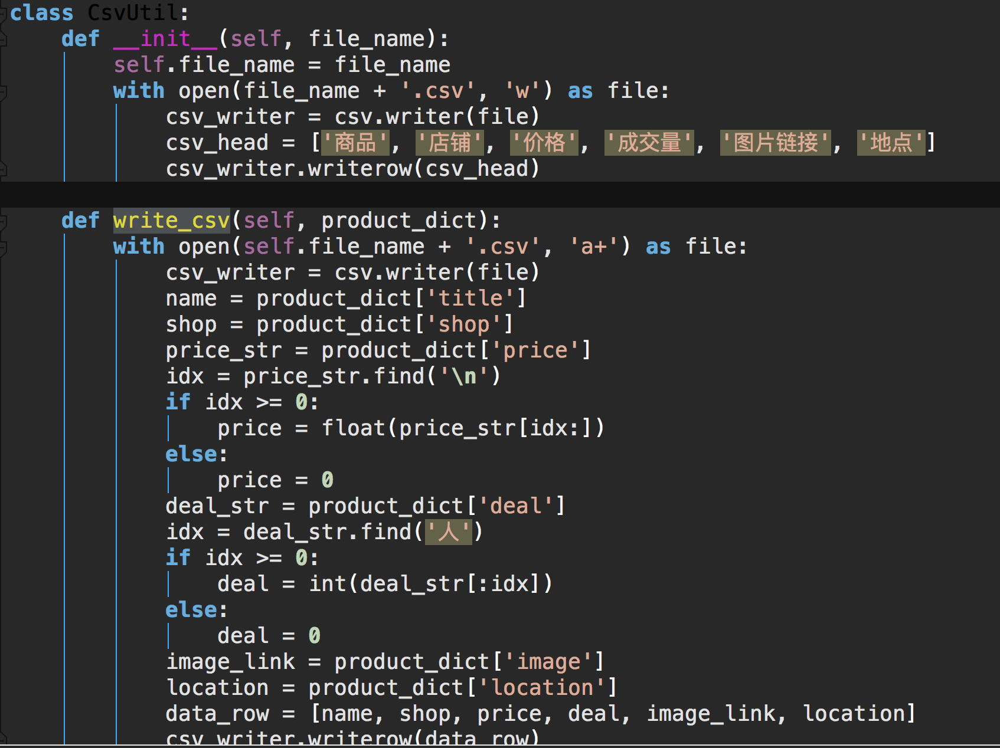

# 一个非常实实在在的淘宝商品信息获取工具
    

#### author: Yu Pan
**项目地址: https://github.com/Pypy233/Data-Analysis/releases** 
## 适用人群: 懒人肥宅

## 代码说明
使用Selenium2模拟自动化搜索淘宝商品并获取信息，在与其他爬虫包括与scrapy对比下selenium更加稳定，在淘宝反爬虫禁掉ip之前能够爬取约20页数据，并存储进以关键词命名的Excel，简单易用

### 爬虫核心代码段（获取商品） 
	def get_products(self):
        html = self.driver.page_source
        doc = pq(html)
        items = doc('#mainsrp-itemlist .items .item').items()
        for item in items:
            product = {
                'image': item.find('.pic .img').attr('data-src'),
                'price': item.find('.price').text(),
                'deal': item.find('.deal-cnt').text(),
                'title': item.find('.title').text(),
                'shop': item.find('.shop').text(),
                'location': item.find('.location').text()
            }
            self.csv_util.write_csv(product_dict=product)
            
 对应截图

### csv存储工具类
	class CsvUtil:
    def __init__(self, file_name):
        self.file_name = file_name
        with open(file_name + '.csv', 'w') as file:
            csv_writer = csv.writer(file)
            csv_head = ['商品', '店铺', '价格', '成交量', '图片链接', '地点']
            csv_writer.writerow(csv_head)

    def write_csv(self, product_dict):
        with open(self.file_name + '.csv', 'a+') as file:
            csv_writer = csv.writer(file)
            name = product_dict['title']
            shop = product_dict['shop']
            price_str = product_dict['price']
            idx = price_str.find('\n')
            if idx >= 0:
                price = float(price_str[idx:])
            else:
                price = 0
            deal_str = product_dict['deal']
            idx = deal_str.find('人')
            if idx >= 0:
                deal = int(deal_str[:idx])
            else:
                deal = 0
            image_link = product_dict['image']
            location = product_dict['location']
            data_row = [name, shop, price, deal, image_link, location]
            csv_writer.writerow(data_row)
对应截图

## Demo
1. 双击发布版本CsvUtil
2. 输入商品关键词

3. 回车启动Chrome自测并扫描二维码登录

4. 自测中

5. 自动保存生成对应imac.csv文件，共21页445条关于iMac最热商品数据

